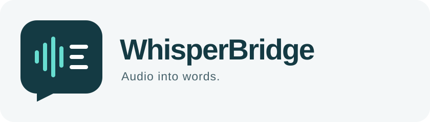

# WhisperBridge

**Audio files → reviewed text → LM Studio prompts.**



WhisperBridge is a small macOS companion for [LM Studio](https://lmstudio.ai/). Drop in a recording, transcribe it locally with Whisper, correct the text, and copy it into any LM Studio prompt. The everyday workflow needs no Python, API key, database, or local server.

WhisperBridge is an independent project. It does not modify LM Studio and does not claim a private plugin API; version 1 uses the dependable macOS clipboard handoff.

## What works

- One-click download and SHA-256 verification of Whisper Base Multilingual
- WAV, MP3, M4A, AAC, and FLAC files up to 500 MiB or two hours
- Automatic language detection or an explicit language choice
- Local decoding and transcription through the pinned `whisper.cpp` framework
- Progress and cancellation for audio preparation and transcription
- Editable transcript with reset, clear, UTF-8 text export, and **Copy for LM Studio**
- macOS App Sandbox, with access limited to files the user chooses

The model download is the only network operation in the core workflow. Audio and transcript text stay on the Mac. Copying text uses the system clipboard, which can sync if Universal Clipboard is enabled.

## Run the app

Requirements: macOS 14 or newer, Apple silicon, and Xcode 16 or newer.

1. Clone the repository and open `WhisperBridge.xcodeproj` in Xcode.
2. Select the **WhisperBridge** scheme and **My Mac** destination.
3. Run the app.
4. Choose **Download Model** on first launch, then select or drop an audio file.
5. Select **Transcribe**, review the result, and choose **Copy for LM Studio**.

The recommended model is about 148 MB and is stored in the app's Application Support container. No model is committed to Git.

## Build and test

The repository includes a repeatable script that keeps Derived Data, Swift module caches, result bundles, fixture data, and logs under `.build-artifacts/`:

```sh
./scripts/build-and-test.sh
```

Eleven XCTest checks cover file policy, invalid input, PCM conversion, model integrity, edit state, cancellation, real `whisper.cpp` transcription, and performance budgets when the local smoke model and fixture are present. A fresh clone skips the large-model smoke and performance checks that require those local assets.

The separate QA kit covers novice setup and product behavior that code tests cannot prove:

- [Complete use cases](docs/USE_CASES.md)
- [Hands-on QA strategy and release gates](qa/PLAN.md)
- [Step-by-step QA cases](qa/CASES.md)
- [Machine-readable cases](qa/cases.json) and [execution records](qa/results.json)
- [Implementation regression report](qa/REGRESSION_REPORT.md)

Validate the QA records with:

```sh
python3 scripts/check_qa.py
```

`python3 scripts/check_qa.py --release` remains blocked until the manual baseline cases have been run on a packaged, signed build with licensed fixtures. Automated test success does not mark those product QA cases as passed.

## Project structure

- `Sources/WhisperBridge/` — SwiftUI app, workflow state, audio decoder, model store, and Whisper engine
- `Tests/WhisperBridgeTests/` — automated unit, decoder, and real-engine smoke tests
- `Vendor/whisper.framework/` — pinned universal macOS framework from `whisper.cpp` v1.9.1
- `docs/` — product decisions, reference research, use cases, and roadmap
- `qa/` — manual QA plan, cases, release gates, and evidence records
- `assets/` — editable SVG brand assets

See [third-party notices](THIRD_PARTY_NOTICES.md) for the vendored engine license and provenance. The working name and visual identity are original project concepts and are not official LM Studio or OpenAI branding.
